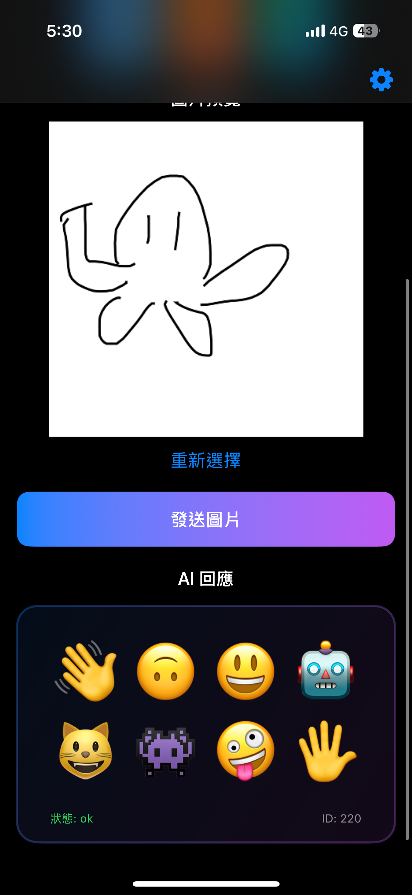

# DrawEmoji — 分散式圖像辨識系統

**開發分散式圖像辨識系統，從手繪圖或照片辨識 Emoji，涵蓋後端 API 設計，以及 App 與網頁端的跨平台整合。**

## 📱 系統展示

### 核心功能演示

### 應用介面展示

#### 手繪圖像辨識

  
  
  

#### 照片上傳與處理

  

#### 讀取歷史紀錄功能

  
  

#### 系統設定與功能

  

## 📊 系統架構

#### 後端系統架構

  

#### App系統架構

  

